GCP 프리티어 사용하기

-	구글 계정 하나 당 $300를 지급해 준다.
-	총 8개의 인스턴스 생성 가능
-	1개의 고정IP 할당 가능

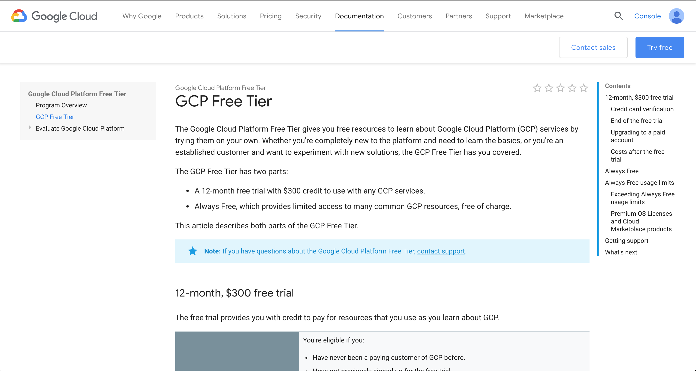

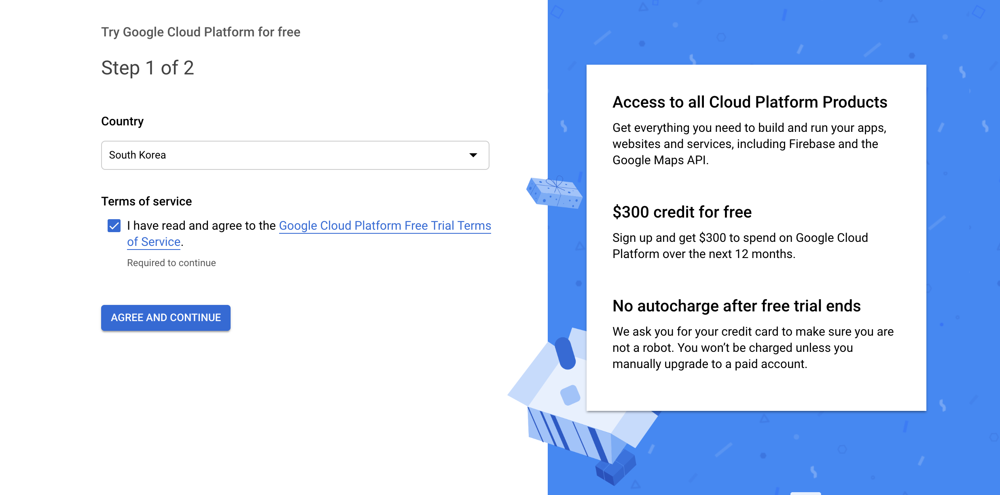

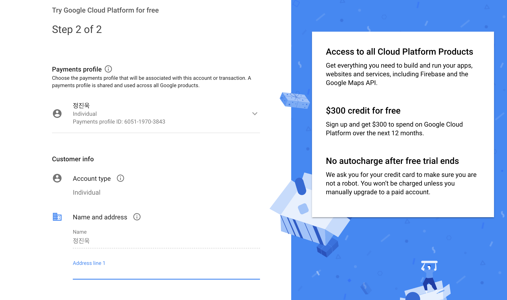

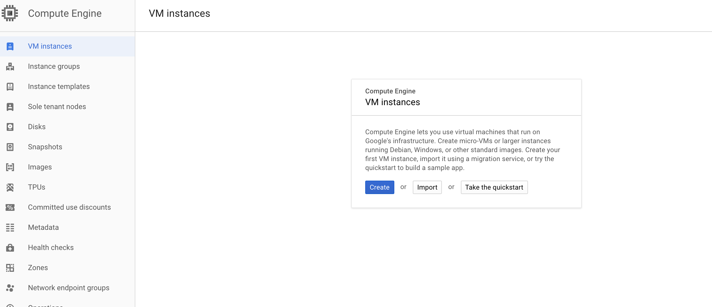

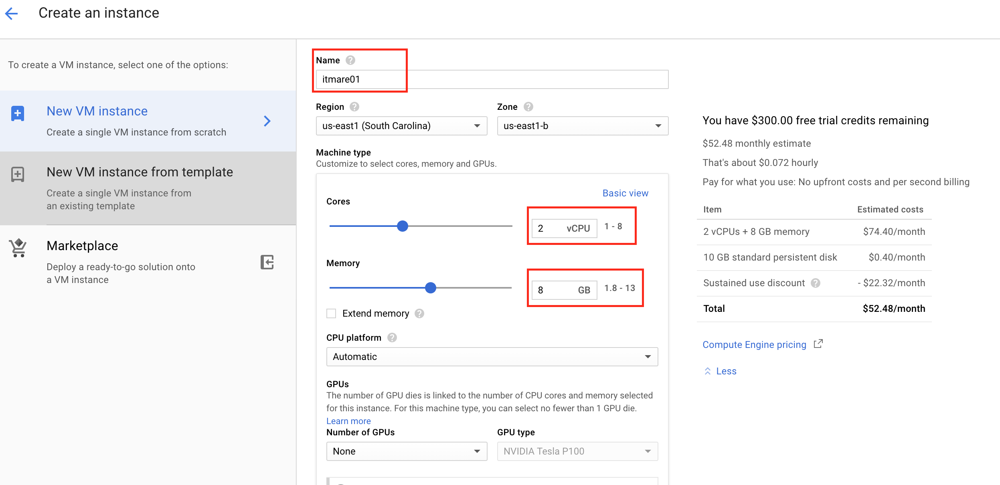

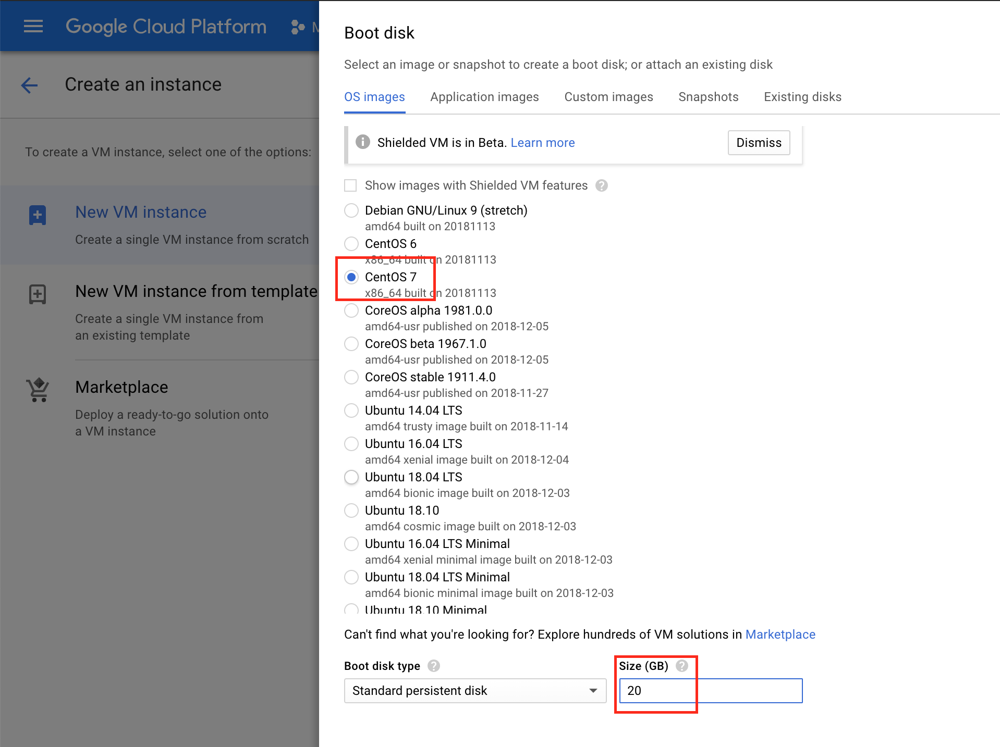

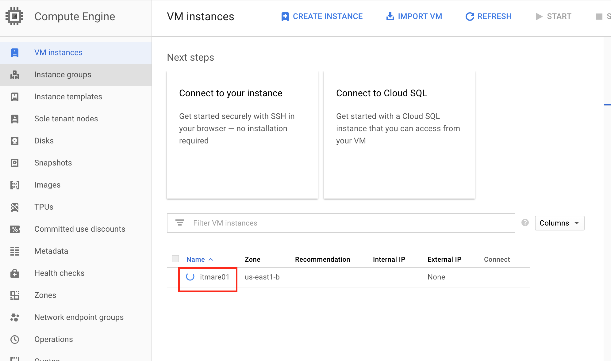

-	인스턴스 생성     

생성한 인스턴스에 고정 아이피 할당하기  
----------------------------------------------

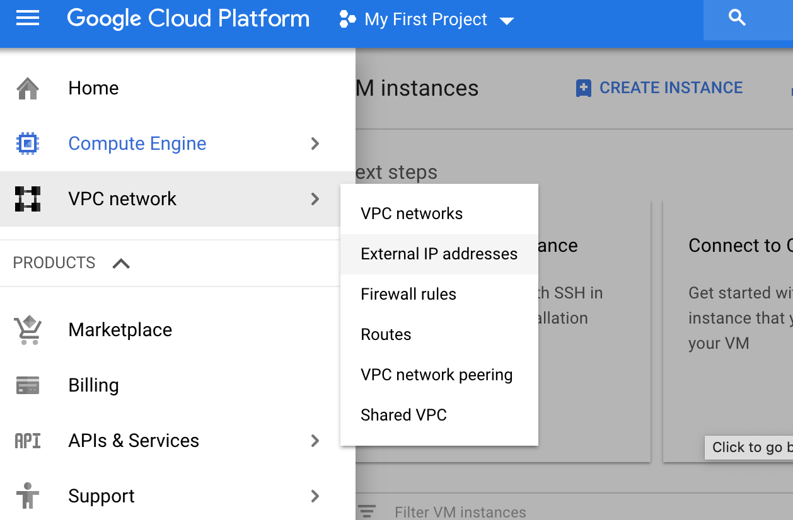

-	  

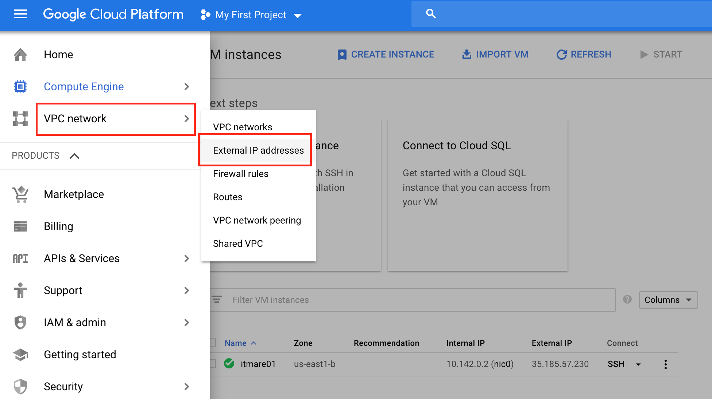

-	  

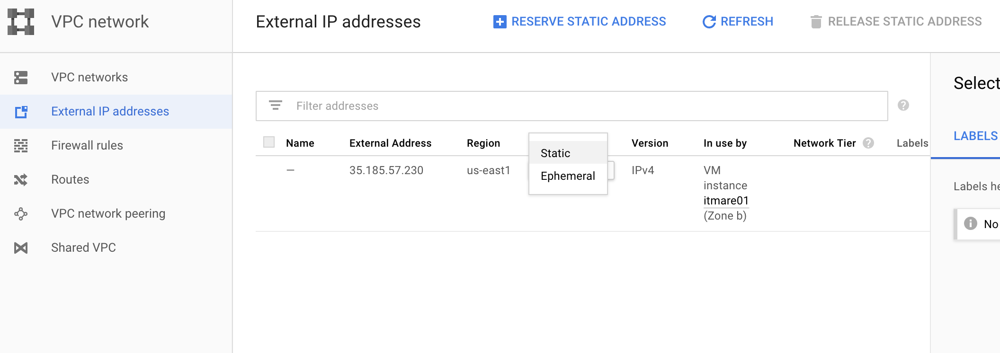

-	  

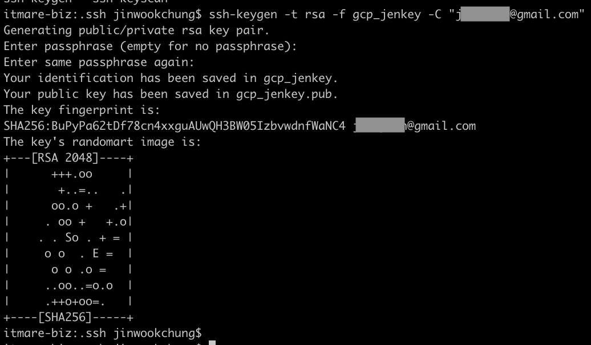

-	로컬에서 ssh키 생성  

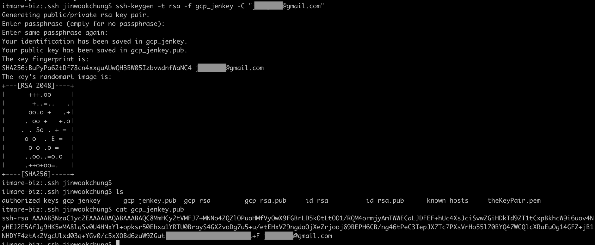

-	생성된 키 복사 (키이름.pub)  

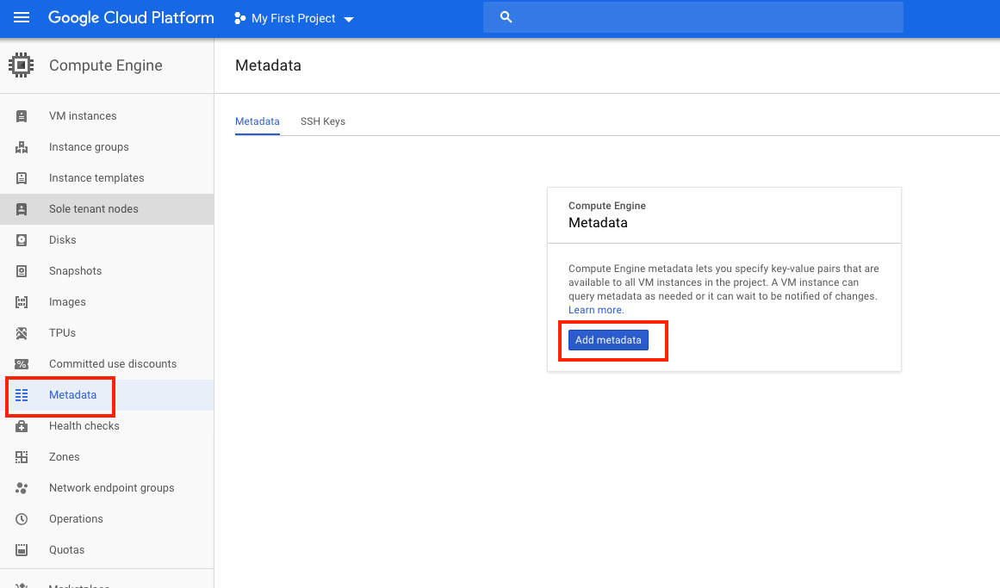

-	gcp metadata에 추가  

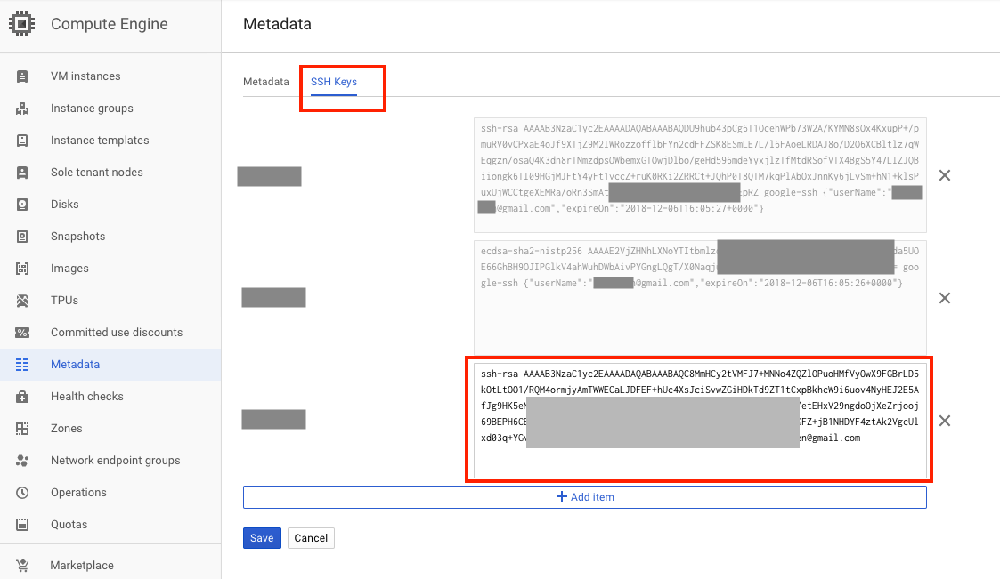

-	SSH keys 탭으로 이동, 키 추가  
